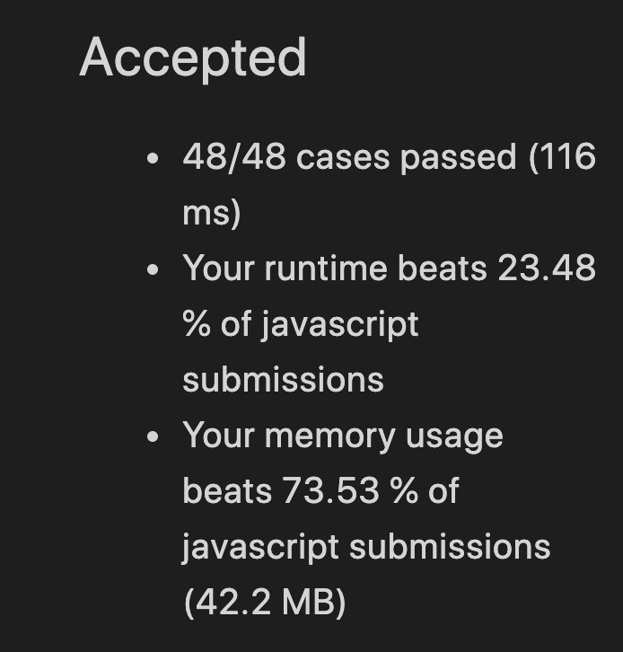
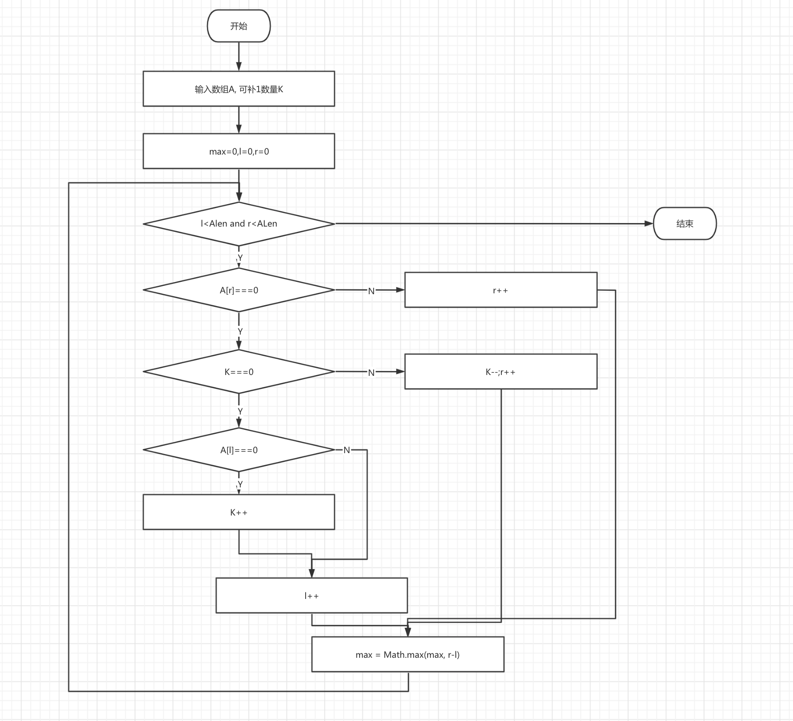

# [485] 最大连续1的个数

### 答题思路

1. 用一个计数器 `max` 记录每一步最大 `1` 的数量, 用 `l` 来记录连续 `1` 的左边下标, 使用 `r` 记录连续 `1` 的右边下标。
2. 当我们右指针 `A[r]` 遇到 `1` 时，`r` 加一。
3. 当我们遇到 `0` 时：
   1. 判断能填补的 `K` 是否大于 `0`，当 `K` 大于 `0` 时， 将 `K` 减一，右指针 `r` 加一，向右移动一位
   2. 当 `k` 等于`0` 时：
      1. 当左边 `A[l]` 的值等于 `0` 时， 将 `K` 加1
      2. 将左边指针右移一位，`l` 加一
4. 将 `r - l` 与 `max` 比较，`max` 记录较大值。
5. 返回 `max`。

### 代码及主要部分注释

```javascript
var longestOnes = function(A, K) {
  let max = 0;
  let l = 0, r = 0, len = A.length
  while( l < len && r < len) {
    if (A[r]) {
      r++;
    } else { 
      if (K === 0) {
        if (!A[l]){ K++ }
        l++
      } else {
        r++;
        K--;
      }
    }
    max = Math.max(max, r - l)
  }
  return max;
};
```


### 算法复杂度计算结果

时间复杂度：O(n)

空间复杂度：O(1)

### LeetCode 运行结果作为参考



### 流程图



