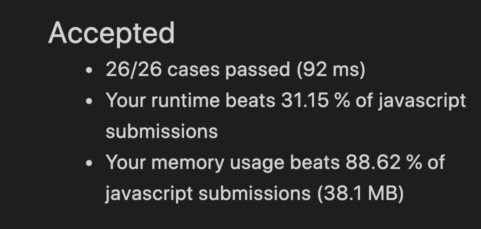

# [414] 第三大的数

### 答题思路

使用3个变量记录最大的3个数


### 代码及主要部分注释

```javascript
var thirdMax = function (nums) {
  let first = nums[0], second, third
  for (let i = 1; i < nums.length; i++) {
    if (nums[i] === first || nums[i] === second || nums[i] === third) {
      continue
    }
    if (nums[i] > first) {
      third = second
      second = first
      first = nums[i]
    } else if (!second || nums[i] > second) {
      third = second
      second = nums[i]
    } else if (!third || nums[i] > third) {
      third = nums[i]
    }
  }

  return third !== undefined?third:first
};
```


### 算法复杂度计算结果

时间复杂度：O(n)

空间复杂度：O(1)

### LeetCode 运行结果作为参考




