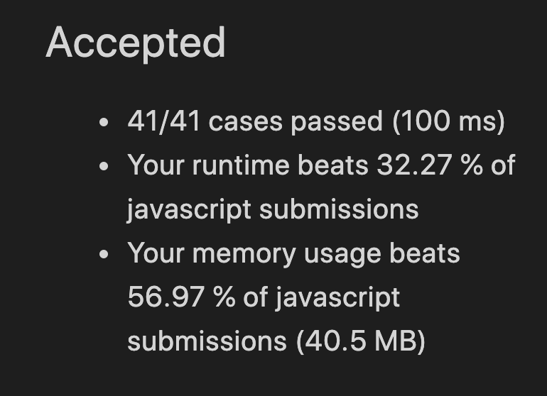
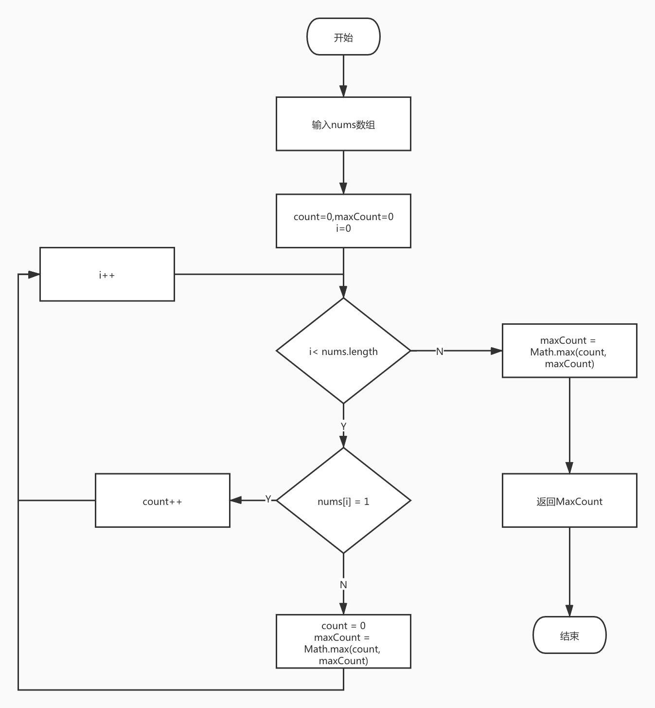

# [485] 最大连续1的个数

### 答题思路

1. 用一个计数器 `count` 记录 1 的数量，另一个计数器 `maxCount` 记录当前最大的 1 的数量。
2. 当我们遇到 `1` 时，`count` 加一。
3. 当我们遇到 `0` 时：
4. 将 `count` 与 `maxCount` 比较，`maxCount` 记录较大值。
5. 将 `count` 设为 `0`。
6. 返回 `maxCount`。

作者：LeetCode
链接：https://leetcode-cn.com/problems/max-consecutive-ones/solution/zui-da-lian-xu-1de-ge-shu-by-leetcode/
来源：力扣（LeetCode）

### 代码及主要部分注释

```javascript
var findMaxConsecutiveOnes = function(nums) {
  let maxConsecutive = 0;
  let currentConsecutive = 0;
  for(let i= 0;i<nums.length;i++) {
    if (nums[i] === 1) {
      currentConsecutive++
    } else {
      maxConsecutive = Math.max(maxConsecutive, currentConsecutive)
      currentConsecutive = 0
    }
  }
  return Math.max(maxConsecutive, currentConsecutive)
};
```


### 算法复杂度计算结果

时间复杂度：O(n)

空间复杂度：O(1)

### LeetCode 运行结果作为参考



### 流程图



