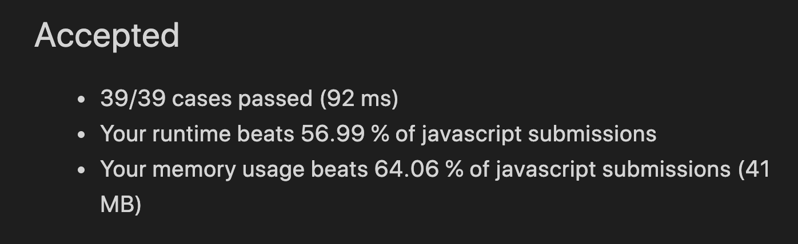

# [495] 提莫攻击

### 答题思路

遍历数组，累加 `相邻攻击时间间隔` 和 `解毒时间` 之间较小的数值


### 代码及主要部分注释

```javascript
var findPoisonedDuration = function(timeSeries, duration) {

  let sum = 0;
  for (let i = 0;i< timeSeries.length - 1;i++) {
    sum = sum + Math.min(timeSeries[i + 1] - timeSeries[i], duration)
  }
  if (timeSeries.length) sum= sum + duration
  return sum

};
```


### 算法复杂度计算结果

时间复杂度：O(n)

空间复杂度：O(1)

### LeetCode 运行结果作为参考




