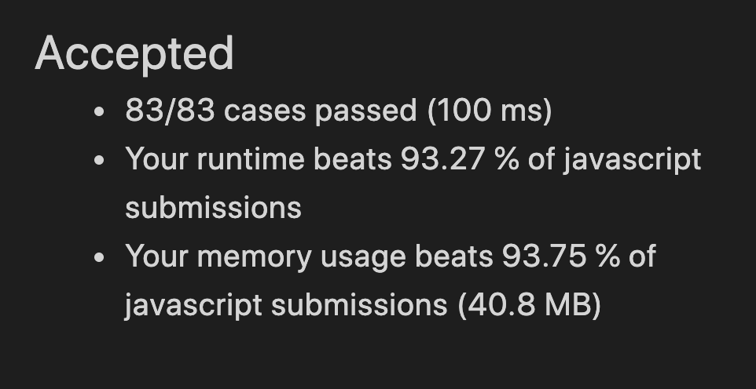

# [628] 三个数的最大乘积

### 答题思路

1. 3位最大乘积，开始考虑最大的3位数相乘即可，
2. 出了一个带负数的用例，就取最大3位和最小两位
3. 比较 `最大 * 第二大 * 第三大` 和 `最大 * 最小 * 第二小` ，返回其中较大的


### 代码及主要部分注释

```javascript
var maximumProduct = function(nums) {
  let first = nums[0], second, third;
  let last = nums[0], lastTwo;
  for (let i = 1;i<nums.length;i++) {
    if (nums[i] >= first) {
      third = second;
      second = first;
      first = nums[i]
    } else if (!second || nums[i] >= second){
      third = second;
      second = nums[i]
    } else if (!third || nums[i] >= third){
      third = nums[i];
    }


    if (nums[i] <= last) {
      lastTwo = last;
      last = nums[i]
    } else if (!lastTwo || nums[i] <= lastTwo) {
      lastTwo = nums[i]
    }
  }

  const maxTree = first * second * third
  const maxWithTwoMin = first * lastTwo * last
  return Math.max(maxTree, maxWithTwoMin)

};
```


### 算法复杂度计算结果

时间复杂度：O(n)

空间复杂度：O(1)

### LeetCode 运行结果作为参考




